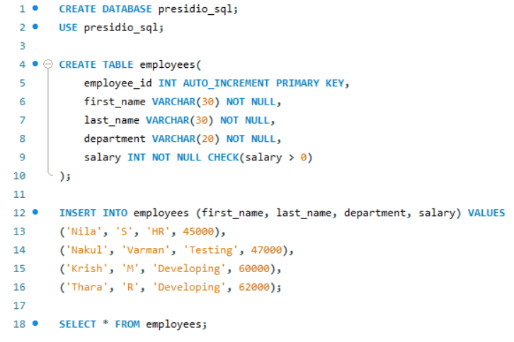
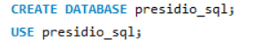
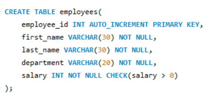
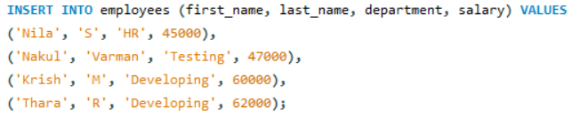
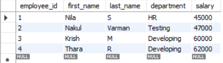

# Task 1 **Creating and Populating Tables**
    
## **Objective:**
- Set up a simple table, insert data, and retrieve that data using basic queries.

## **Implementation:**



### 1. Create Database and Use It:

```sql
CREATE DATABASE database_name;
```

- Creates a new database to store your tables and data.

```sql
USE database_name;
```

- Selects the created database to execute queries within it.



### 2. Create Table

```sql
CREATE TABLE table_name (
    column1 datatype constraints,
    column2 datatype constraints,
    ...
);
```

- The `CREATE TABLE` statement is used to define a new table in the selected database.
- Each column is defined with a name, data type, and optional constraints.



#### Constraints in SQL:
- Constraints are rules applied to table columns to enforce data integrity and consistency.

##### Common Constraints:
- PRIMARY KEY – Uniquely identifies each row in a table. It automatically implies both NOT NULL and UNIQUE. Only one primary key is allowed per table.

- NOT NULL – Ensures that a column must always have a value. It prevents the insertion of NULL values into the column.

- AUTO_INCREMENT – Automatically generates a unique numeric value for a column when a new row is inserted.

- CHECK – Validates that the values in a column meet a specified condition. If the condition is not met, the insertion is rejected.

- UNIQUE – Ensures that all values in a column are different from each other. Allows NULL values unless combined with NOT NULL.

- DEFAULT – Assigns a default value to a column if no value is specified during insertion.

- FOREIGN KEY – Enforces a link between the data in two tables by referencing the PRIMARY KEY of another table.

### 2. Insert Data:

```sql
INSERT INTO table_name (column1, column2, ...) VALUES
(value1, value2, ...),
(value1, value2, ...);
```
- The `INSERT INTO` statement adds multiple rows of data in a single query.



### 4. Retrieve Data:

```sql
SELECT * FROM table_name;
```

- The `SELECT * FROM` statement fetches all rows and columns from the table.


###### Result: 

