# **Task 10 – Comprehensive Database Design, Optimization, and Advanced Features**

## **Objective :**
Design and implement a normalized database schema for an eCommerce-like platform with advanced SQL features including indexing, triggers, transactions, views, and testing.

## **Contents :**

1. [Schema Design](#schema-design)
2. [Data Insertion](#data-insertion)
3. [Indexing for Performance](#indexing-for-performance)
4. [Triggers](#triggers)
5. [Transactions](#transactions)
6. [Views](#views)
7. [Testing](#testing)
8. [Conclusion](#conclusion)


## **Schema Design**
- There are 4 main tables:
    - `Customers`
    - `Products`
    - `Orders`
    - `OrderDetails`

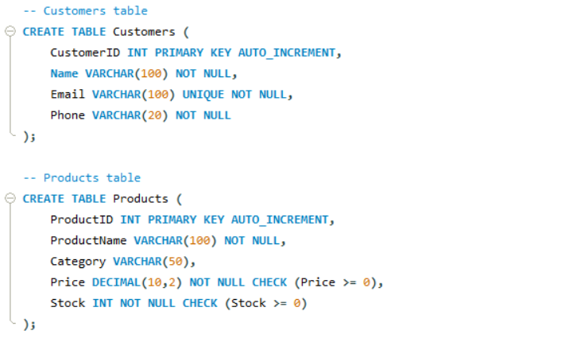

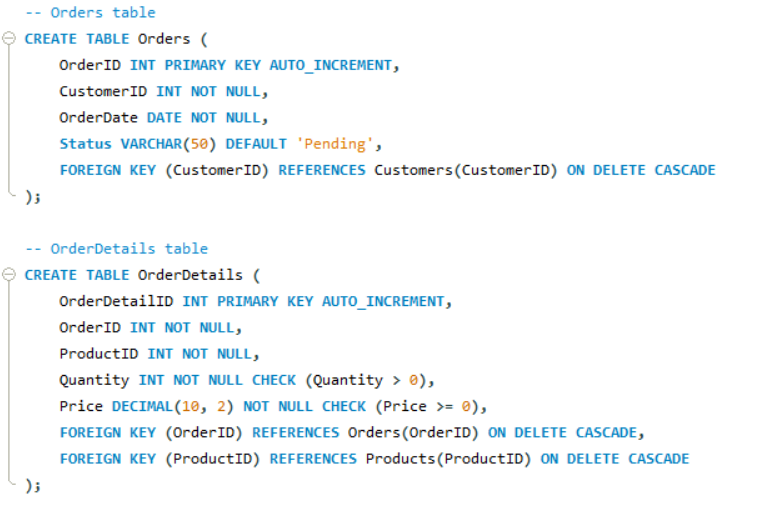

### **Constraints Used:**

| Constraint          | Description                                                                 |
|---------------------|-----------------------------------------------------------------------------|
| PRIMARY KEY         | Uniquely identifies each row in the table.                                  |
| AUTO_INCREMENT      | Automatically increases the value of the key field for each new entry.      |
| NOT NULL            | Field must be provided — disallows null values.                             |
| UNIQUE              | Ensures all values in a column are different (e.g., Email).                 |
| CHECK               | Validates that column values meet certain conditions (e.g., Price >= 0).    |
| FOREIGN KEY         | Enforces referential integrity between tables.                              |
| ON DELETE CASCADE   | Automatically deletes dependent rows when a referenced row is deleted.      |

### **1. Customers Table:**

```sql
CREATE TABLE Customers (
    CustomerID INT PRIMARY KEY AUTO_INCREMENT,
    Name VARCHAR(100) NOT NULL,
    Email VARCHAR(100) UNIQUE NOT NULL,
    Phone VARCHAR(20) NOT NULL
);
```

- Stores basic customer details like name, email, and phone number.

#### **Relationships:**
- `CustomerID` is referenced by the `Orders` table.
- One customer can place multiple orders (1-to-many relationship).

#### **Constraints:**

| Column       | Constraint(s)                             | Purpose                                    |
|--------------|-------------------------------------------|--------------------------------------------|
| CustomerID   | PRIMARY KEY, AUTO_INCREMENT               | Unique identifier for each customer.       |
| Name         | NOT NULL                                  | Requires name to be filled.                |
| Email        | UNIQUE, NOT NULL                          | Prevents duplicate emails.                 |
| Phone        | NOT NULL                                  | Mandatory contact number.                  |

---

### **2. Products Table:**

```sql
CREATE TABLE Products (
    ProductID INT PRIMARY KEY AUTO_INCREMENT,
    ProductName VARCHAR(100) NOT NULL,
    Category VARCHAR(50),
    Price DECIMAL(10,2) NOT NULL CHECK (Price >= 0),
    Stock INT NOT NULL CHECK (Stock >= 0)
);
```

- Contains inventory data, such as product name, price, category, and stock availability.

#### **Relationships:**
- `ProductID` is referenced by the `OrderDetails` table.
- One product can appear in many order details (1-to-many relationship).

#### **Constraints:**

| Column        | Constraint(s)                             | Purpose                                      |
|---------------|-------------------------------------------|----------------------------------------------|
| ProductID     | PRIMARY KEY, AUTO_INCREMENT               | Unique product identifier.                   |
| ProductName   | NOT NULL                                  | Each product must have a name.               |
| Category      | —                                         | Optional product category.                   |
| Price         | NOT NULL, CHECK (Price >= 0)              | Price can't be null or negative.             |
| Stock         | NOT NULL, CHECK (Stock >= 0)              | Inventory must be valid (non-negative).      |

---

### **3. Orders Table:**

```sql
CREATE TABLE Orders (
    OrderID INT PRIMARY KEY AUTO_INCREMENT,
    CustomerID INT NOT NULL,
    OrderDate DATE NOT NULL,
    Status VARCHAR(50) DEFAULT 'Pending',
    FOREIGN KEY (CustomerID) REFERENCES Customers(CustomerID) ON DELETE CASCADE
);
```

- Header for an order placed by a customer (1 per order).
- Captures the order event — who placed the order, when, and its current status.

#### **Relationships:**
- `CustomerID` is a foreign key from `Customers`. 
- One customer can have multiple orders (1-to-many relationship).
- `OrderID` is referenced by `OrderDetails`.
- One order can have multiple order details (1-to-many relationship).

#### **Constraints:**

| Column       | Constraint(s)                                                              | Purpose                                        |
|--------------|----------------------------------------------------------------------------|------------------------------------------------|
| OrderID      | PRIMARY KEY, AUTO_INCREMENT                                                | Unique order reference.                        |
| CustomerID   | NOT NULL, FOREIGN KEY → Customers(CustomerID) ON DELETE CASCADE            | Links order to a customer; cascades delete.    |
| OrderDate    | NOT NULL                                                                   | Order date must be recorded.                   |
| Status       | DEFAULT 'Pending'                                                          | Defaults to pending if not specified.          |

---

### **4. OrderDetails Table:**

```sql
CREATE TABLE OrderDetails (
    OrderDetailID INT PRIMARY KEY AUTO_INCREMENT,
    OrderID INT NOT NULL,
    ProductID INT NOT NULL,
    Quantity INT NOT NULL CHECK (Quantity > 0),
    Price DECIMAL(10, 2) NOT NULL CHECK (Price >= 0),
    FOREIGN KEY (OrderID) REFERENCES Orders(OrderID) ON DELETE CASCADE,
    FOREIGN KEY (ProductID) REFERENCES Products(ProductID) ON DELETE CASCADE
);
```

- Line items per product in an order.
- Stores detailed breakdown of items in each order — what products were bought, how many, and at what price.
- This enables multiple products per order.

### **Relationships:**
- `OrderID` is a foreign key from `Orders`.
- `ProductID` is a foreign key from `Product`s.
- One order can include multiple products, and each product can appear in many orders (many-to-many relationship implemented via OrderDetails).

#### **Constraints:**

| Column         | Constraint(s)                                                                 | Purpose                                               |
|----------------|-------------------------------------------------------------------------------|-------------------------------------------------------|
| OrderDetailID  | PRIMARY KEY, AUTO_INCREMENT                                                   | Unique line item per order.                           |
| OrderID        | NOT NULL, FOREIGN KEY → Orders(OrderID) ON DELETE CASCADE                     | Ties item to specific order; cascades delete.         |
| ProductID      | NOT NULL, FOREIGN KEY → Products(ProductID) ON DELETE CASCADE                 | Links product being purchased; cascades delete.       |
| Quantity       | NOT NULL, CHECK (Quantity > 0)                                                | Must purchase at least one unit.                      |
| Price          | NOT NULL, CHECK (Price >= 0)                                                  | Price at time of purchase must be non-negative.       |

---

## **Data Insertion**

- Insert the sample data.

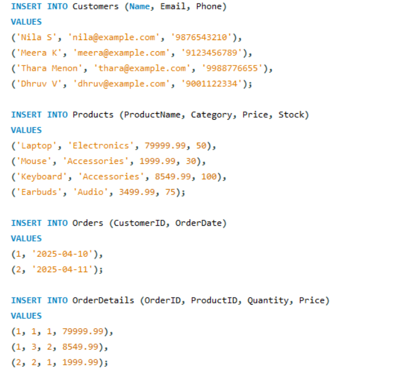

---

## **Indexing for Performance**
- In a growing eCommerce database, operations like searching, filtering, and joining can become time-consuming.
- Without indexes, the database performs full table scans, which are slow and inefficient. 
- Indexing helps:
    - Speed up data retrieval
    - Reduce full table scans
    - Improve join efficiency
    - Boost overall query performance

### **Analyse Performance**

### **1. Sample Query for Optimization :**
- Use the following query to retrieve all orders placed by a specific customer (CustomerID = 1) with order and product details:

```sql
SELECT o.OrderID, o.OrderDate, c.Name, p.ProductName, od.Quantity, od.Price
FROM Orders o
JOIN Customers c ON o.CustomerID = c.CustomerID
JOIN OrderDetails od ON o.OrderID = od.OrderID
JOIN Products p ON od.ProductID = p.ProductID
WHERE c.CustomerID = 1;
```

### 2. **Analysis Before Indexing :**
- Analyze this query with `EXPLAIN` to understand how the database executes it before adding any indexes:

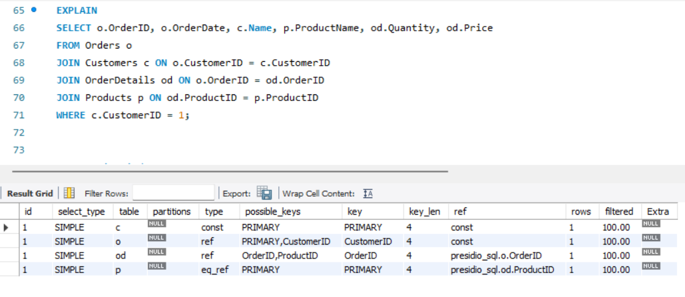

***Key Observations:***
- **Indexes Used:** Only primary keys and foreign keys were implicitly indexed.
- **Type = ALL:** Full table scan on most tables.
- **Key = NULL:** No indexes were utilized for optimization.
- **Rows = High:** Large number of rows scanned, leading to inefficiency.

### **3. Applying Indexes :**
- To improve performance, explicitly create indexes on commonly joined and filtered columns

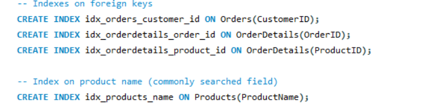

### **4. Analysis After Indexing :**
- Reanalyze the query using EXPLAIN after creating indexes:

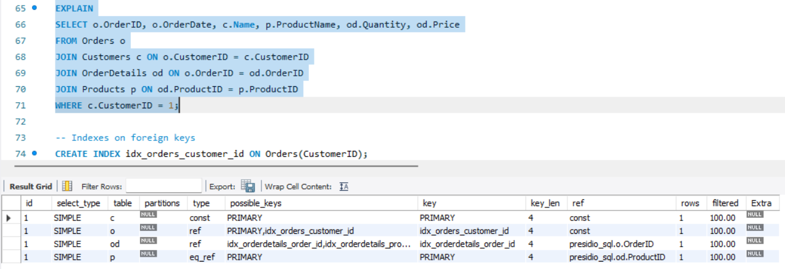

***Key Improvements :***
- **Indexes Used:** Explicit indexes were created on foreign keys (idx_orders_customer_id, idx_orderdetails_order_id).
- **Type = ref or const:** The database uses index-based row lookup for the joins instead of full table scans.
- **Key:** The query now uses specific index keys for faster, more efficient row access, reducing the need for table scans.
- **Rows = Lower:** Significantly fewer rows scanned due to the more efficient use of indexes.


### **5. Comparison of `EXPLAIN` (Before vs After Indexing)**

| Feature          | Before Indexing                | After Indexing                            |
|------------------|--------------------------------|--------------------------------------------|
| **Indexes Used** | Implicit only (PKs, FKs)       | Explicit indexes on key columns            |
| **Type**         | ALL (full table scan)          | ref / const (index-based lookups)          |
| **Key**          | NULL                           | idx_orders_customer_id, idx_orderdetails_order_id |
| **Rows**         | High row scans                 | Fewer rows scanned                         |
| **Efficiency**   | Low                            | Improved performance                       |


### **6. Performance Profiling:**
- To further validate the impact of indexing, enable profiling to measure query execution time:

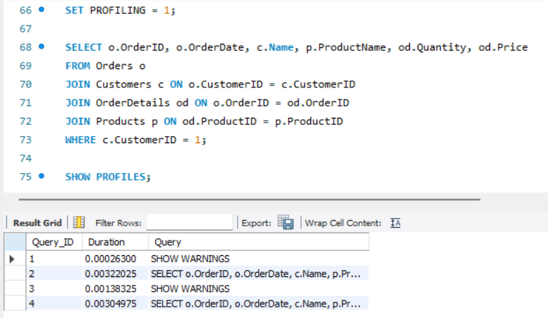

### **Query Profiling Results**

| Query | Description      | Time Taken (sec) |
|-------|------------------|------------------|
| #2    | Without Indexes  | 0.00322025       |
| #4    | With Indexes     | 0.00304975       |
|       | **Difference**   | **0.0001705**    |


***Note :*** 
- Although the difference is small in this case (due to a small dataset), the improvement would be much more significant on larger, real-world datasets.

---

## **Triggers**
- Triggers in SQL are special procedures that automatically execute (or "fire") in response to certain events on a specific table or view.
- A trigger is a database object that runs automatically when a specific INSERT, UPDATE, or DELETE operation occurs on a table. It is used to enforce rules, maintain data consistency, or automate actions (like logging or updating related tables).

### **Trigger for Stock Update :**
- A trigger is used to automatically update the product stock whenever a new order is placed.
- This ensures real-time consistency in inventory without requiring manual updates after every transaction.
- Whenever a new row is inserted into the OrderDetails table (i.e., a product is purchased), the corresponding product’s Stock in the Products table is decreased by the ordered quantity.

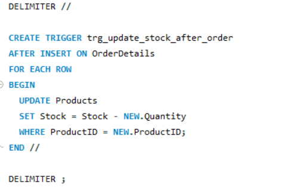

| **Component**     | **Description**                                                                |
|-------------------|--------------------------------------------------------------------------------|
| `AFTER INSERT`    | Trigger fires after a new row is inserted into `OrderDetails`.                 |
| `FOR EACH ROW`    | Ensures the trigger runs once per row inserted.                                |
| `NEW.Quantity`    | Refers to the quantity of the product ordered.                                 |
| `NEW.ProductID`   | Refers to the product that is being ordered.                                   |
| `UPDATE Products` | Adjusts the stock by subtracting the purchased quantity.                       |


### **Testing the Trigger:**

###  **1. Check Stock Before Order:**
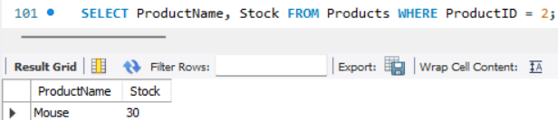

- This query checks the current stock of the product before placing a new order to validate the effect of the trigger later.

### **2. Insert New Order and OrderDetails:**
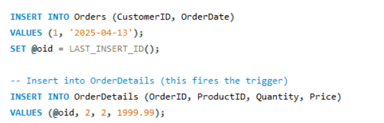

- This simulates placing a new order and purchasing a product.
-  The `OrderDetails` insert will fire the trigger to automatically update the product stock.

### **3. Check Stock After Order:**
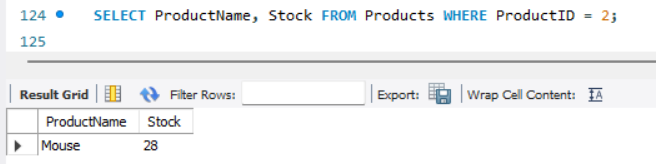

- This verifies that the stock has been decreased correctly after the order, proving the trigger worked as expected.

---

## **Transactions**
- **Transactions** ensure that a series of SQL operations are executed **as a single unit**, maintaining data integrity even if something fails.
- In this case, the `PlaceOrder` stored procedure wraps order placement logic in a **transaction block**, ensuring **either all operations succeed** or **none at all** (rollback on failure).

- This stored procedure:
  - Inserts a new record into the `Orders` table.
  - Retrieves the generated `OrderID`.
  - Inserts a related record into the `OrderDetails` table.
  - Automatically fires the **trigger** to update the product's stock.
  - If any part fails (e.g., invalid product ID or insufficient stock), the **entire transaction is rolled back**.

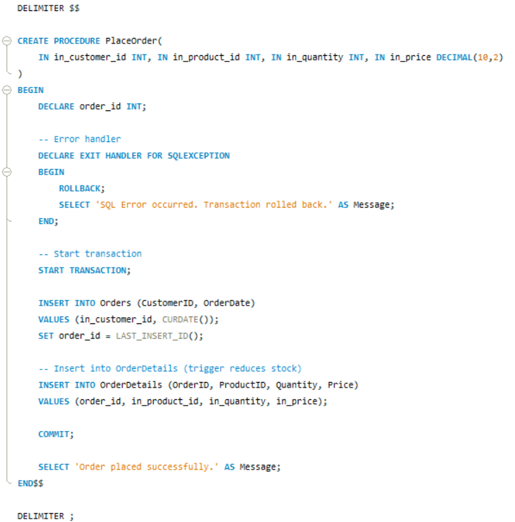

| **Component**        | **Description**                                                                 |
|----------------------|----------------------------------------------------------------------------------|
| `START TRANSACTION`  | Begins the transaction block — multiple operations will be grouped together.    |
| `LAST_INSERT_ID()`   | Retrieves the newly inserted `OrderID` for use in `OrderDetails`.               |
| `INSERT INTO`        | Adds entries into `Orders` and `OrderDetails`, which triggers stock update.     |
| `COMMIT`             | Finalizes the transaction if everything succeeds.                               |
| `ROLLBACK`           | Reverses all operations if any error occurs.                                    |
| `EXIT HANDLER`       | Catches SQL exceptions and rolls back the transaction to maintain consistency.  |

### **Testing the Transaction:**

#### Before Transaction :
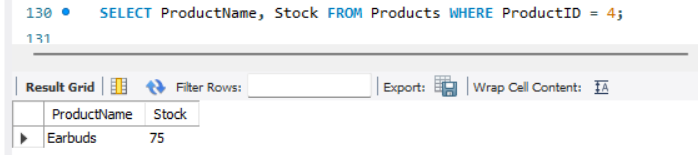

### **1. Valid Order with Sufficient Stock:**

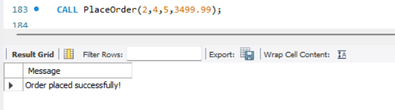

- **Outcome:** Stock is sufficient → transaction succeeds → order and order details are inserted → trigger updates stock.

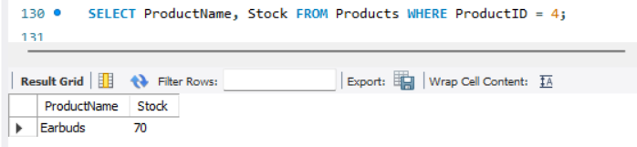

### **2. Order Exceeding Stock Limit:**
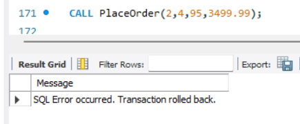

- **Outcome:** Likely stock too low → trigger may fail (if constraint exists) or logic error → rollback happens → no data is inserted.


### **3. Invalid Product ID:**
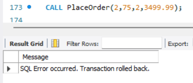

- **Outcome:** Invalid `ProductID` → insert into `OrderDetails` fails → error handler rolls back → stock remains unchanged.


## **Views**
- A **View** is a virtual table based on the result of a SQL `SELECT` query.
- It helps in simplifying complex joins, improving **readability**, and supporting **data abstraction**.

### **Purpose of the View:**
- Quickly see customer order history.
- Monitor product sales and revenue generated.
- Avoid writing complex joins repeatedly.

### **View for Order Summary**
- In this case, `OrderSummary` provides a combined view of customers, orders, products, and pricing — all in a single table format.

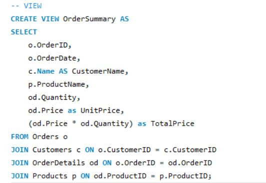

### **Querying the View**

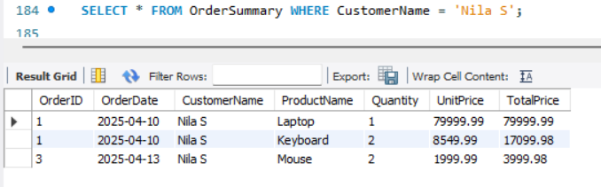

**Outcome:** Retrieves all orders placed by customer "Nila S", showing product details and total order value.

Views are especially useful for reporting, analytics, and dashboards — without exposing raw table structures!

## **Testing**
- This section validates whether each database feature works as intended. 
- Testing was done using SQL queries and manual inspection of results to ensure correctness and performance improvements.

### **1. Schema Validation**

**Objective:** Verify that the schema follows the correct structure, constraints, and relationships.  
[See Implementation → Schema Design](#schema-design)

- **Test:** Tried inserting invalid data (e.g., negative prices, NULL in NOT NULL fields, duplicate emails).
- **Expected Result:** Insertion fails due to constraint violations.
- **Result:** Constraints like `NOT NULL`, `CHECK`, `UNIQUE`, and foreign key restrictions work as expected.

---

### **2. Data Insertion**

**Objective:** Populate tables with sample data to simulate a real-world scenario.  
[See Implementation → Sample Data Insertion](#data-insertion)

- **Test:** Inserted multiple records into `Customers`, `Products`, `Orders`, and `OrderDetails`.
- **Expected Result:** Data should be successfully inserted without violating constraints.
- **Result:** Data inserted successfully and available for querying and joining.

---

### **3. Indexing Validation**

**Objective:** Measure query performance before and after indexing.  
[See Implementation → Indexing for Optimization](#analyse-performance)

- **Test:** Executed a JOIN-heavy query to fetch order details for a specific customer.
- **Tool Used:** `EXPLAIN` and `SHOW PROFILE` for query analysis.
- **Result:** Query plan showed reduced table scans and improved performance after indexing.

| Metric              | Before Indexing     | After Indexing      |
|---------------------|---------------------|----------------------|
| Query Type          | Full Table Scan     | Index-based Lookup   |
| Time Taken (sec)    | 0.00322             | 0.00304              |
| Efficiency          | Low                 | High                 |

---

### **4. Trigger Functionality**

**Objective:** Ensure product stock is automatically updated when a new order is placed.  
[See Implementation → Trigger for Stock Update](#testing-the-trigger)

- **Test:** 
  - Checked stock before order.
  - Inserted new `OrderDetails` row.
  - Checked stock again.
- **Expected Result:** Stock should decrease by the ordered quantity.
- **Result:** Trigger fired successfully and updated stock accordingly.

---

### **5. Transaction Testing**

**Objective:** Validate transaction behavior (e.g., atomicity, rollback on error).  
[See Implementation → Transactions](#testing-the-transaction)

- **Test Case:**
  - Begin transaction.
  - Insert into `Orders` and `OrderDetails`.
  - Intentionally cause an error (e.g., insert invalid `Quantity = -5`) and ROLLBACK.
- **Expected Result:** Neither insert should persist in the database.
- **Result:** Transaction rollback worked as expected, maintaining data integrity.

---

### **6. View Testing**

**Objective:** Test accuracy and usability of the `OrderSummaryView`.  
[See Implementation → Views](#view-for-order-summary)

- **Test:** Queried the view to check order summaries.
- **Expected Result:** View should return correct order-level aggregation (total amount).
- **Result:** View correctly summarized total order values and matched expected values.

---

### **7. Final Validation**

- Cross-verified foreign key behavior with `ON DELETE CASCADE`.
- Performed JOIN queries across all tables to ensure integrity and relational correctness.
- Attempted edge cases (duplicate insertions, negative quantities, etc.)

**Result:** All features were tested and worked as expected. Database behaves reliably under different operations.
