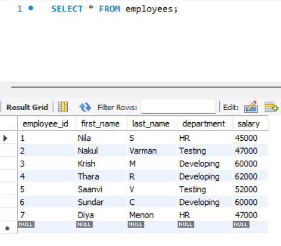
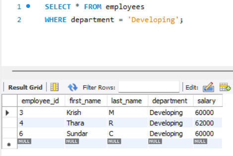
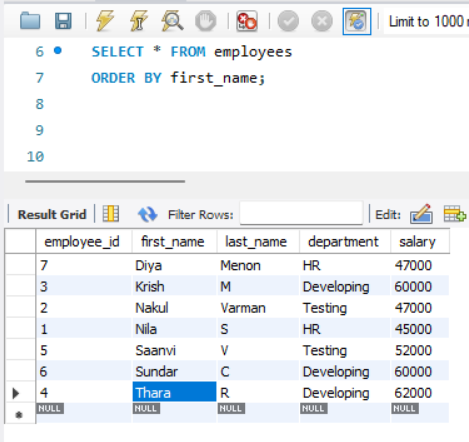
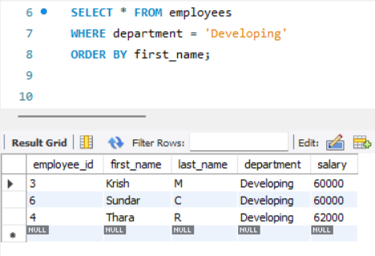
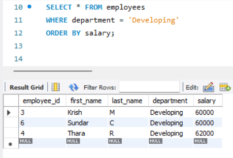
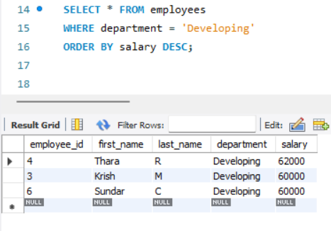
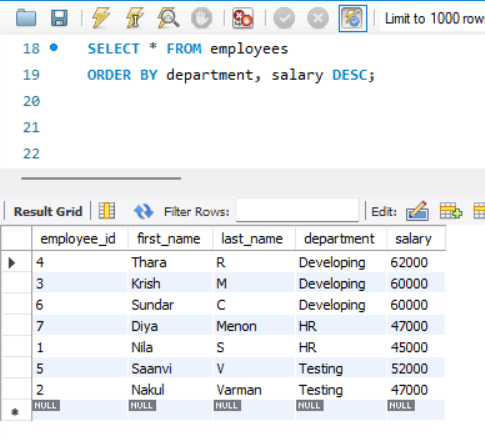
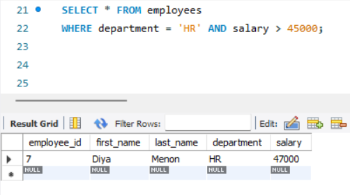
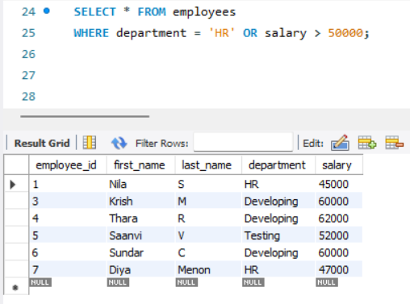

# Task 2 **Basic Filtering and Sorting**
    
## **Objective:**
- Write queries that filter records and sort the result set.

## **Requirements:**
- Use the `WHERE` clause to filter records based on a condition.
- Apply the `ORDER BY` clause to sort the results.
- Experiment with multiple conditions using `AND`/`OR`.

## **Implementation:**

### 1. View All Employees

```sql
SELECT * FROM table_name;
```

- Retrieves all rows and columns from the specified table.
- The asterisk * is a wildcard used to select every column in the table.



- This query fetches all employee data from the employees table.


### 2. Filter Using `WHERE`:

```sql
SELECT * FROM table_name
WHERE condition;
```

- The `WHERE` clause is used to filter records that meet a specific condition.
- Only the rows satisfying the condition will be returned.



- Retrieves only employees working in the Developing department.


### 3. Sorting Using `ORDER BY`:

```sql
SELECT * FROM table_name
ORDER BY column_name [ASC|DESC];
```

- `ORDER BY` sorts the result set by the given column.
- `ASC` for ascending order (default), `DESC` for descending order.



- Sorts the employees alphabetically by first name.




- Filters employees from Developing and sorts them alphabetically by first name.




- Filters employees from Developing and sorts by increasing salary.

 


- Filters employees from Developing and sorts by decreasing salary

 


- Sorts the employees by department name, then by salary in descending order within each department.


 
### 4. Filtering with Multiple Conditions:

```sql
SELECT * FROM table_name
WHERE condition1 AND/OR condition2;
```

- `AND` returns records only if both conditions are true.
- `OR` returns records if at least one condition is true.




- Filters employees who are in the HR department and also have a salary greater than 45,000.




- Filters employees who are either in HR or have a salary greater than 50,000.