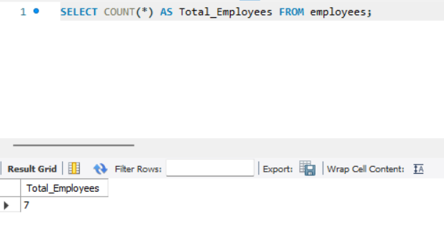
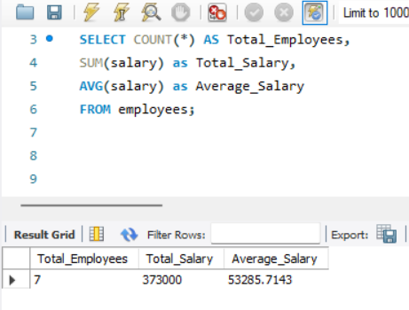
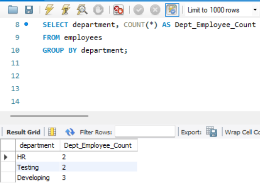
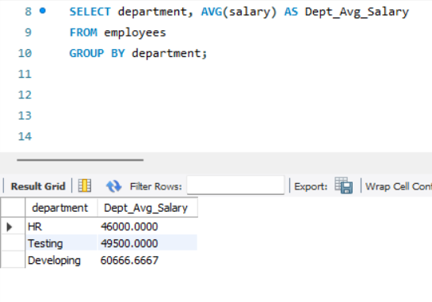
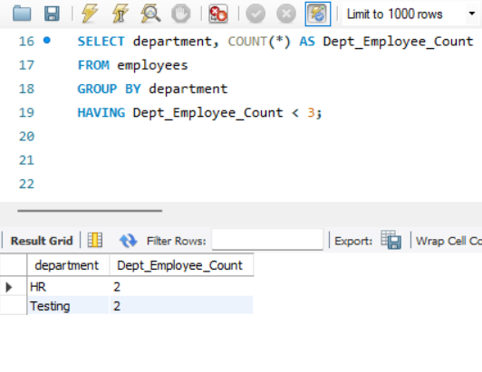
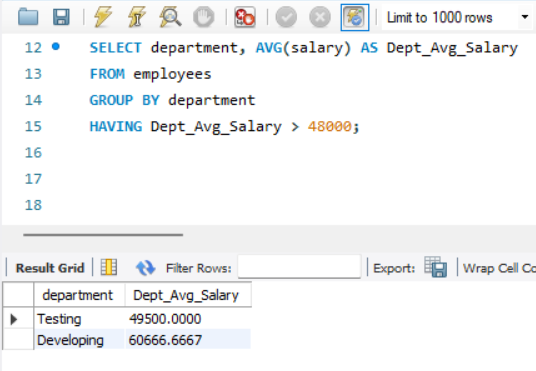

# Task 3: **Simple Aggregation and Grouping**

## **Objective:**
- Summarize data using aggregate functions and grouping.

## **Requirements:**
- Use aggregate functions such as `COUNT()`, `SUM()`, or `AVG()`.
- Group data using the `GROUP BY` clause.
- Use the `HAVING` clause to filter grouped results (optional).

## **Implementation:**

### 1. Aggregate Functions:

```sql
SELECT AGG_FUNC(column_name) FROM table_name;
```

- `AGG_FUNC()` can be:
  - `COUNT()` – Count of records
  - `SUM()` – Total sum
  - `AVG()` – Average value
  - `MIN()` – Minimum value
  - `MAX()` – Maximum value
- Aggregate functions return a single value for a set of rows.



- Counts the total number of employees.



- Returns the total number of employees, the sum of all salaries, and the average salary.

### 2. Grouping Records with `GROUP BY`:

```sql
SELECT column_name, AGG_FUNC(column_name)
FROM table_name
GROUP BY column_name;
```

- `GROUP BY` groups rows based on the value of one or more columns into summary rows.
- Often used with aggregate functions to return one result per group.



- Groups employees by department and counts how many employees are in each.



- Groups employees by department and shows the average salary of each group.

###  3. Filtering Grouped Records with `HAVING`:

```sql
SELECT column_name, AGG_FUNC(column_name)
FROM table_name
GROUP BY column_name
HAVING condition;
```

- `HAVING` is used after grouping to filter aggregated results.
- Similar to `WHERE`, but used for groups, not individual rows.



- Returns only departments that have less than 3 employees.




- Returns departments where the average salary is greater than 48,000.