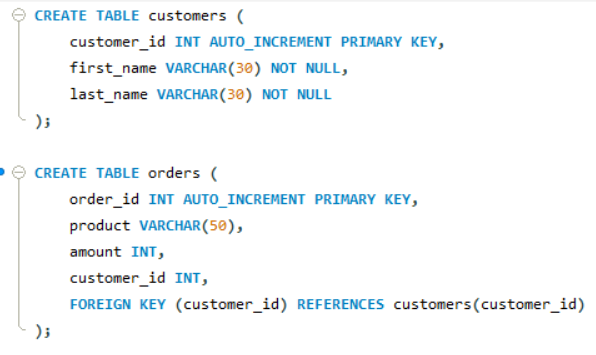
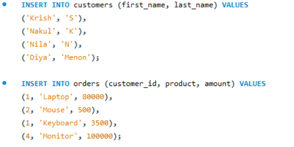
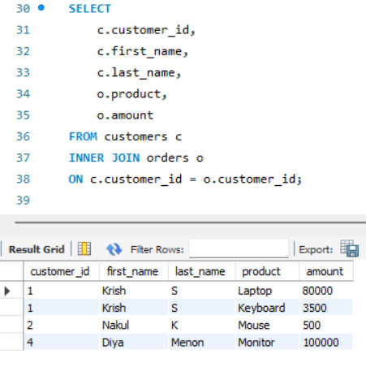
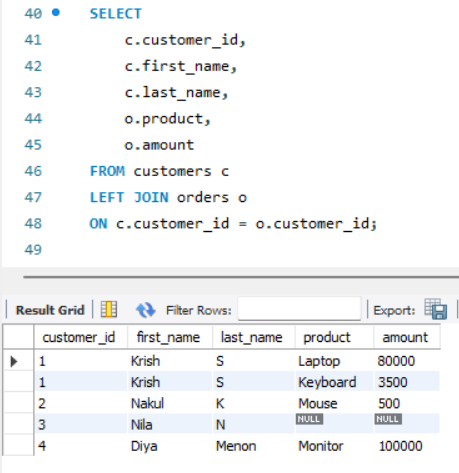
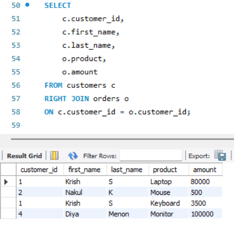

# Task 4 **Multi-Table JOINs**
    
## **Objective:**
- Combine data from two related tables using JOIN operations.

## **Requirements:**
- Create two related tables (e.g., `Customers` and `Orders`) with a foreign key relationship.
- Write an `INNER JOIN` query to retrieve combined information.
- Experiment with other types of joins such as `LEFT JOIN` to understand how missing matches are handled.

## **Implementation:**

### 1. **Create Tables and Insert Data**

#### Create Tables:
```sql
CREATE TABLE table_name (
    column1 datatype CONSTRAINTS,
    ...
    FOREIGN KEY (fk_column) REFERENCES other_table(pk_column)
);
```
- The `FOREIGN KEY` constraint is used to create a relationship between two tables by referencing the `PRIMARY KEY` of another table.
- One table should have a primary key, and the other should reference that key to establish the relationship.
- It ensures that the value in the foreign key column must match an existing value in the referenced table’s primary key column.



- Two tables are created:
    - `customers`: contains basic customer details.
    - `orders`: contains order information and a `foreign key` customer_id referencing the customers table.

#### Insert Data:



### 2. **INNER JOIN:**

```sql
SELECT columns
FROM table1
INNER JOIN table2 ON table1.column = table2.column;
```

- Returns only those records where there is a match in both tables.
- Excludes rows from either table that don’t have corresponding values in the joined table.



- Retrieves only customers who have placed at least one order.

### 3.**LEFT JOIN:**

```sql
SELECT columns
FROM table1
LEFT JOIN table2 ON table1.column = table2.column;
```

- Returns all records from the left table and matching records from the right table.
- If there is no match in the right table, the result will contain `NULL` in those columns.



- Includes all customers, even those who haven’t placed any orders (order info will be NULL).

### 4. **RIGHT JOIN:**

```sql
SELECT columns
FROM table1
RIGHT JOIN table2 ON table1.column = table2.column;
```

- Returns all records from the right table and matching records from the left table.
- If there is no match in the left table, `NULL` values are returned for the left table’s columns.



- Includes all orders even if there's no customer match (rare due to FK constraint).


