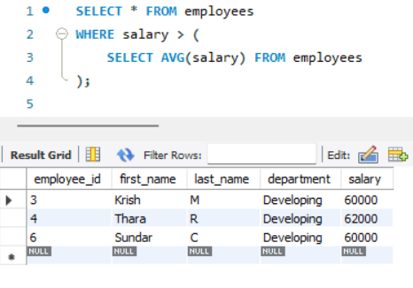
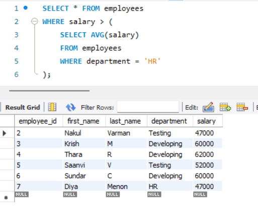
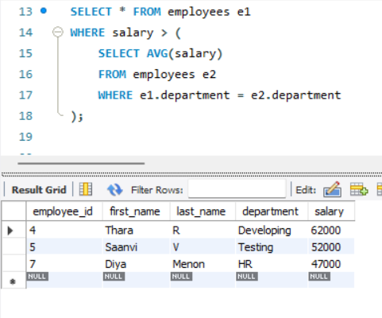
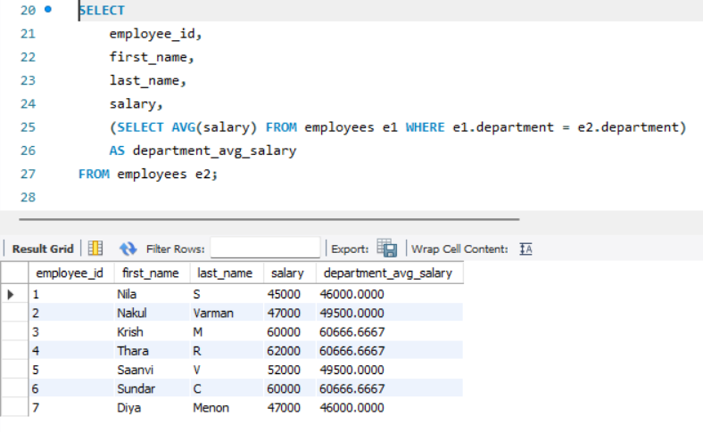

# 5. **Subqueries and Nested Queries**
    
## **Objective:**
- Use subqueries to filter or compute values within a main query.

## **Requirements:**
- Use subqueries in the WHERE clause.
- Use subqueries in the SELECT list for dynamic columns.
- Understand the difference between correlated and non-correlated subqueries.

## **What is a Subquery?**
- A subquery is a query nested inside another SQL query. 
- It is enclosed in parentheses and used to return data that will be used by the main (outer) query.

- Subqueries can be used in:
    - WHERE clause
    - SELECT clause
    - FROM clause

## **Implementation:**

### 1. **Subquery in the `WHERE` Clause:**

#### **Non-Correlated Subquery**

```sql
SELECT columns
FROM table
WHERE column OPERATOR (SELECT sub_column FROM other_table WHERE condition);
```
##### Example 1:



- Returns employees whose salary is greater than the overall average salary.
- This is a non-correlated subquery, as it does not depend on the outer query.
- The subquery is executed once, and the result is compared against all rows.

##### Example 2:



- Filters employees whose salary is higher than the average salary of the HR department.
- This is also a non-correlated subquery because no reference to the outer query is made.

 
#### **Correlated Subquery**

```sql
SELECT * 
FROM outer_table o
WHERE o.column > (
    SELECT AVG(inner_table.column)
    FROM inner_table
    WHERE inner_table.related_column = o.related_column
);
```



- This is a correlated subquery: the inner query depends on the outer query (WHERE e1.department = e2.department).
- For each employee, the subquery computes the average salary of their own department.
- The subquery runs once per outer row.

### 2. **Subquery in `SELECT` Clause (Derived Columns)**

```sql
SELECT column1,
       (SELECT column2 FROM table2 WHERE condition) AS alias_name
FROM table1;
```


- This adds a dynamic column that shows the average salary of the employee’s department.
- It is a correlated subquery because the subquery references the outer query’s department.


## Correlated vs. Non-Correlated Subqueries

| Feature                    | Correlated Subquery                         | Non-Correlated Subquery                  |
|---------------------------|---------------------------------------------|------------------------------------------|
| References outer query?   | Yes                                         |  No                                      |
| Execution                 | Once per row of outer query                 | Executed once for entire outer query     |
| Use case                  | Row-wise comparisons (e.g., per department) | Static comparisons (e.g., company-wide)  |
| Performance               | May be slower on large datasets             | More efficient                           |
| Example                   | `e1.department = e2.department`             | `WHERE salary > (SELECT AVG(salary))`    |
