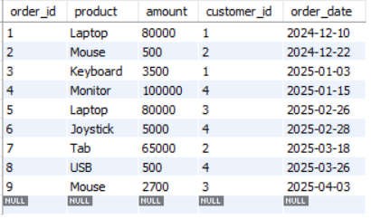
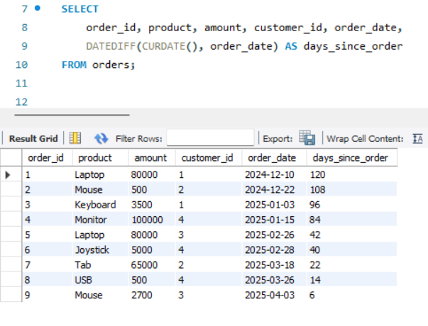
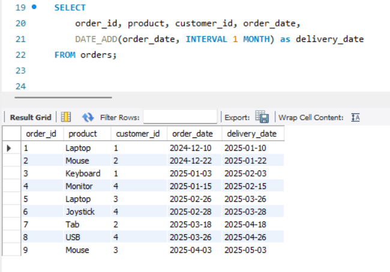
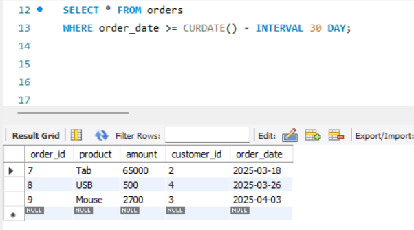
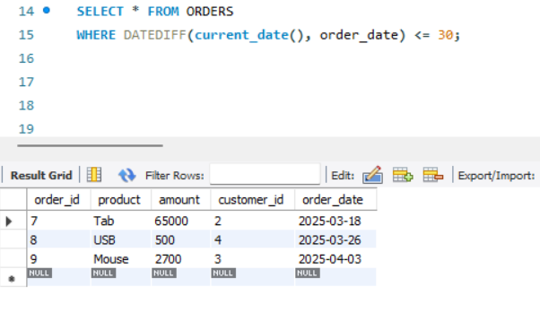
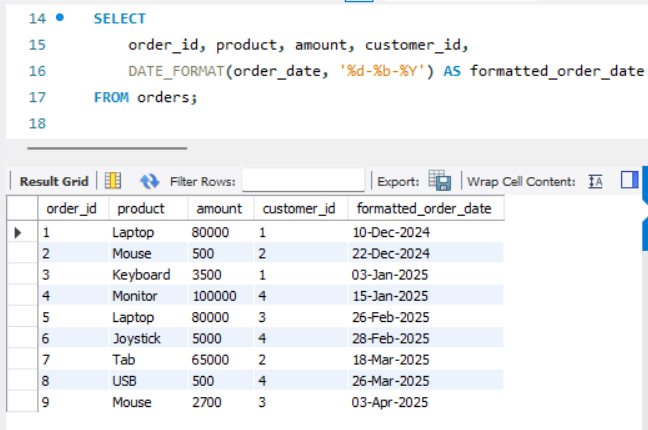

# Task 6 **Date and Time Functions**
    
## **Objective:**
- Manipulate and query data based on date and time values.

## **Requirements:**
- Use built-in date functions (e.g., `DATEDIFF`, `DATEADD`, or your SQL dialect’s equivalent) to calculate intervals or adjust dates.
- Write a query to filter records based on date ranges (e.g., orders placed within the last 30 days).
- Format date outputs if necessary using functions like `CONVERT` or `TO_CHAR`.

## **Implementation:**

### **Table:**



### **1. Calculate Intervals:**

#### `DATEDIFF`:

```sql
DATEDIFF(date1, date2)
```

- `DATEDIFF(date1, date2)` returns the number of days between date1 and date2.
- Returns a positive number if date1 is after date2, and a negative number if the opposite.



- Here, DATEDIFF() returns the number of days between the current date and the order date.
- Shows how many days have passed since each order was placed.

#### `DATE_ADD`:

```sql
DATE_ADD(date_column, INTERVAL n unit)
```

- DATE_ADD(date, INTERVAL n unit) adds a specific time interval to a date.
- The INTERVAL units can be:
    - DAY
    - WEEK
    - MONTH
    - YEAR



- Adds 1 month to each order date to simulate a delivery date 1 month after the order was placed.
    
### **2. Filter Records:**

#### Method 1: Using `INTERVAL` with `CURDATE()`:

```sql
WHERE date_column >= CURDATE() - INTERVAL n DAY
```

- Efficient way to get rows within a recent timeframe.
- This is index-friendly and performs better than using DATEDIFF() in WHERE.



- Returns orders placed within the last 30 days from today.

#### Method 2: Using `DATEDIFF` (Less efficient):

```sql
WHERE DATEDIFF(CURDATE(), date_column) <= n
```
- Retrieves recent records but does so by computing the date difference for every row, making it slower.
- Easier to understand but slower, especially on large tables.



- Filters orders placed in the last 30 days.
- Less efficient because it evaluates the function per row, making indexes unusable.

## INTERVAL vs. DATEDIFF for Filtering Records

| Feature                      | `INTERVAL` (Date Arithmetic)                             | `DATEDIFF` (Function-Based Filtering)                |
|------------------------------|----------------------------------------------------------|------------------------------------------------------|
| **Syntax**                   | `WHERE order_date >= CURDATE() - INTERVAL 30 DAY`        | `WHERE DATEDIFF(CURDATE(), order_date) <= 30`        |
| **Returns**                  | `INTERVAL` returns a calculated **date**                 | `DATEDIFF` returns a calculated **number of days**   |
| **Execution**                | Compares actual date values directly                     | Calculates difference in days for each row           |
| **Index Usage**              | Index-friendly – can use indexes on `order_date`         | Not index-friendly – disables index on `order_date`  |
| **Performance**              | More efficient on large datasets                         | Slower for large datasets                            |
| **Best Use Case**            | Production-level queries where performance matters       | Quick testing or small datasets                      |

### **3. Format Date Outputs:**

```sql
DATE_FORMAT(date_column, 'format_string')
```
- Converts the date into a more human-readable or customized format.



- Formats the date as DD-Day-YYYY for better readability.

### **Common Date Format Patterns:**

| Format String      | Description                          | Example Output       |
|--------------------|--------------------------------------|----------------------|
| `%Y`               | 4-digit year                         | `2025`               |
| `%y`               | 2-digit year                         | `25`                 |
| `%m`               | 2-digit month (01-12)                | `04`                 |
| `%c`               | Month (1-12, no leading zero)        | `4`                  |
| `%b`               | Abbreviated month name               | `Apr`                |
| `%M`               | Full month name                      | `April`              |
| `%d`               | Day of the month (01-31)             | `08`                 |
| `%e`               | Day of the month (1-31, no zero)     | `8`                  |
| `%a`               | Abbreviated weekday name             | `Mon`                |
| `%W`               | Full weekday name                    | `Monday`             |
| `%H`               | Hour (00-23)                         | `14`                 |
| `%h` or `%I`       | Hour (01-12)                         | `02`                 |
| `%i`               | Minutes (00-59)                      | `30`                 |
| `%s`               | Seconds (00-59)                      | `45`                 |
| `%p`               | AM or PM                             | `PM`                 |
| `%r`               | Time in 12-hour format (hh:mm:ss AM/PM) | `02:30:45 PM`     |
| `%T`               | Time in 24-hour format (hh:mm:ss)    | `14:30:45`           |
| `%D`               | Day of the month with suffix         | `8th`                |
