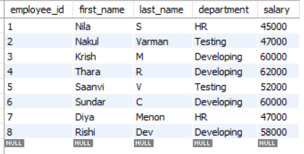
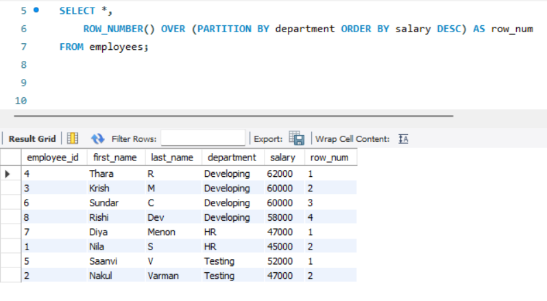
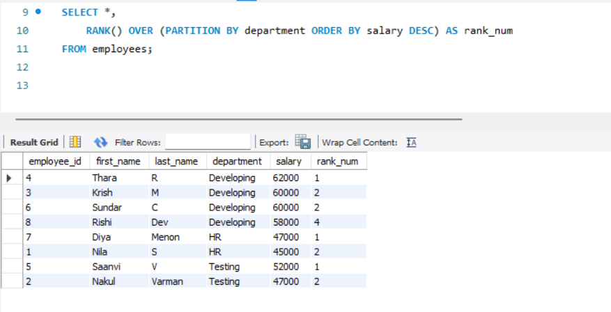
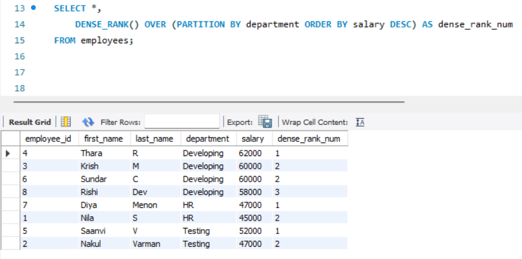
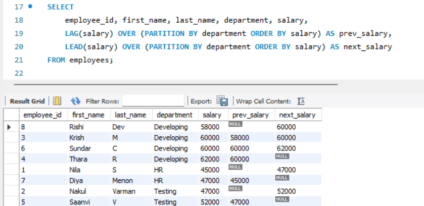

# Task 7 **Window Functions and Ranking**
    
## **Objective:**
- Leverage window functions to perform calculations across a set of rows.

## **Requirements:**
- Write a query using window functions such as `ROW_NUMBER()`, `RANK()`, or `DENSE_RANK()` to assign ranks.
- Use `PARTITION BY` to define groups and `ORDER BY` to specify the ranking order.
- Experiment with other window functions like `LEAD()` or `LAG()` to access adjacent row values.

## **What are Window Functions?**
- Window functions perform calculations across a set of rows that are related to the current row — called a "window".
- Unlike aggregate functions, window functions do not collapse rows into a single result. Instead, they return a result for every row, preserving row-level granularity.
- Examples include: ROW_NUMBER(), RANK(), DENSE_RANK(), LEAD(), LAG(), SUM(), AVG(), etc.

#### Syntax of a Window Function:

```sql
FUNCTION_NAME() OVER (
    PARTITION BY column1
    ORDER BY column2
)
```
- `OVER()`:
    - Defines a window (a set of rows) over which the window function operates - without collapsing the rows like GROUP BY does.

- `PARTITION BY`:
    -  It is used inside the OVER() clause to split the rows into groups (windows). 
    - The window function is applied within each partition separately.
    - It is like GROUP BY for window functions — but it doesn’t collapse rows.

- `ORDER BY` 
    - Defines how rows are ordered within each partition, affecting output of ranking functions.

## **Implementation:**

### Table:



### 1. ROW_NUMBER():

```sql
ROW_NUMBER() OVER (PARTITION BY column ORDER BY column)
```

- Assigns a unique sequential number to rows within a partition.
- Resets numbering for each PARTITION BY group.
- No duplicates — every row gets a distinct number.



- Partitions employees by department.
- Within each department, assigns numbers from 1 based on descending salary.
- Highest-paid employee in each department = row number 1.

### 2. RANK():

```sql
RANK() OVER (PARTITION BY column ORDER BY column)
```
- Assigns ranks within a group.
- Equal values get the same rank.
- Skips the next ranks if duplicates exist.



- Ranks employees in each department by salary.
- If two employees tie for the top salary, both get rank 1, and the next rank is 3 (skips 2).

### 3. DENSE_RANK():

```sql
DENSE_RANK() OVER (PARTITION BY column ORDER BY column)
```

- Like RANK(), but does not skip ranks.
- Equal values share the same rank, and the next rank is the next number.



- Ranks employees by salary within each department.
- Handles ties like RANK() but without leaving gaps in the ranking.


### 4. LEAD() and LAG():

```sql
LEAD(column, offset, default) OVER (PARTITION BY column ORDER BY column)
LAG(column, offset, default) OVER (PARTITION BY column ORDER BY column)
```

- LEAD() looks forward: gets the next row's value.
- LAG() looks backward: gets the previous row's value.
- Great for comparing a row to neighbors.



- For each employee:
    - LAG() fetches salary of the previous employee in the same department.
    - LEAD() fetches salary of the next employee in the same department.

