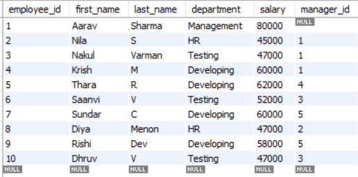
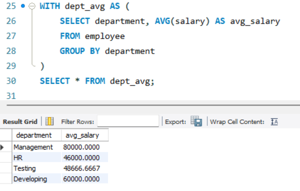
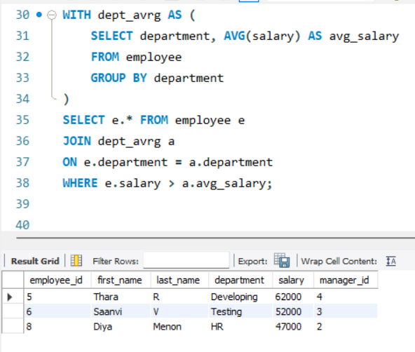
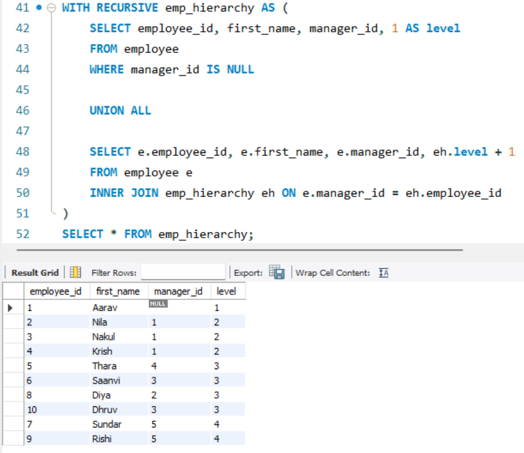

# Task 8. **Common Table Expressions (CTEs) and Recursive Queries**
    
## **Objective:**
- Simplify complex queries and process hierarchical data using CTEs.

## **Requirements:**
- Write a non-recursive CTE to structure a multi-step query for readability.
- Create a recursive CTE to display hierarchical data.
- Ensure proper termination of the recursive CTE to avoid infinite loops.


## **What is a CTE?**
- A **Common Table Expression (CTE)** is a temporary result set defined within the execution scope of a single SQL query.
- It can be referenced within a `SELECT`, `INSERT`, `UPDATE`, or `DELETE` statement.
- CTEs are defined using the `WITH` keyword and allow you to create a named, reusable subquery within your SQL statement.
-  They provide a way to simplify complex queries and make them more readable.

```sql
WITH cte_name AS (
    SELECT ...
)
SELECT * FROM cte_name;
```

It helps:
- Improve **readability** of complex queries.
- Break down a query into **logical building blocks**.
- Handle **hierarchical data** (like org charts) through **recursive CTEs**.
- Efficient in recursive scenarios like:
    - Organizational structure
    - File systems
    - Parent-child relationships

## **Implementation:**

### **Table:**



### **1. Non-Recursive CTE**

#### Syntax:

```sql
WITH cte_name AS (
    SELECT column1, column2
    FROM your_table
    WHERE condition
)
SELECT * FROM cte_name;
```

- A non-recursive CTE is simply a named temporary result set.
- It does not call itself — it's used like a subquery, but cleaner.
- Ideal for splitting a query into steps to improve readability and reuse.

#### Example 1: Department Average Salary



- Calculates the average salary per department
- `dept_avg` becomes a virtual table storing average salary for each department.

#### Example 2: Employees earning above department average



- First, computes average salary per department.
- Then, filters only those employees whose salary is greater than the average of their respective departments.

### **2. Recursive CTE**

#### Syntax:
```sql
WITH RECURSIVE cte_name AS (
    -- Anchor member
    SELECT ...
    FROM table
    WHERE condition

    UNION ALL

    -- Recursive member
    SELECT ...
    FROM table t
    JOIN cte_name c ON t.column = c.column
)
SELECT * FROM cte_name;
```

- A recursive CTE is a CTE that refers to itself.
- Useful for processing hierarchical or tree-structured data like:
    - Employee → Manager chains
    - Categories and subcategories
- It consists of:
    - Anchor member: the base case (e.g., top-level manager)
    - Recursive member: builds upon the previous results
- Recursion continues until no new rows are returned.

#### Example: Employee Hierarchy



```text
Aarav (ID 1 - CEO)
├── Nila (HR)
│   └── Diya
├── Nakul (Testing)
│   ├── Saanvi
│   └── Dhruv
└── Krish (Developing)
    └── Thara
        ├── Sundar
        └── Rishi
```

- Anchor part: Gets the top-level employee (Aarav - no manager_id).
- Recursive part: Joins employees reporting to the current manager (builds the chain).
- `level` helps indicate how deep each employee is in the hierarchy.
- For example, level 1 is the top manager, level 2 are direct reports, and so on.
- The recursion stops once no more employees are left to match.

- ***Note:*** Always ensure your recursive CTE has a termination condition, or else it can run into an infinite loop or performance issues.