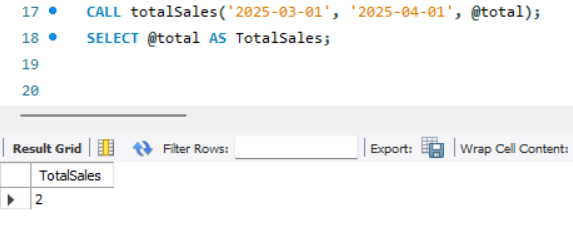

# Task 9 **Stored Procedures and User-Defined Functions**
    
## **Objective:**
- Encapsulate business logic using stored procedures and functions.

## **Requirements:**
- Create a stored procedure that accepts parameters and returns a result set.
- Write a scalar or table-valued user-defined function that performs a calculation.
- Test the procedure and function by calling them and verifying their outputs.


## **What are Stored Procedures?**
- A Stored Procedure is a reusable, precompiled set of one or more SQL statements that perform a specific task. 
- It can:
    - Accept input parameters
    - Return output parameters
    - Encapsulate complex business logic
    - Improve reusability and performance

### Syntax (SQL):

```sql
-- Create a stored procedure named ProcedureName
CREATE PROCEDURE ProcedureName 
    @Parameter1 INT, 
    @Parameter2 VARCHAR(50)  
AS
BEGIN
    -- SQL statements go here
    SELECT * FROM TableName WHERE Column1 = @Parameter1 AND Column2 = @Parameter2;
END
```
- `CREATE PROCEDURE` is used to define the stored procedure.
- Parameters are declared using `@` (e.g., @Parameter1).
- The SQL logic is placed inside the BEGIN ... END block.
- The procedure can be executed using the `EXEC` or `EXECUTE` command.


### Syntax (MySQL):

```sql
DELIMITER //
CREATE PROCEDURE procedure_name(
    IN param1 datatype,
    IN param2 datatype,
    OUT output_param datatype
)
BEGIN
    -- SQL statements
END //
DELIMITER ;
```
- `DELIMITER //` - MySQL normally ends a statement with ;, but because stored procedures contain multiple statements (including ;), we temporarily change the delimiter to // to avoid confusion.
- `CREATE PROCEDURE` is used to define the stored procedure.
- Stored procedure has three type of parameter modes:
    - `IN`	  ->  Used to pass a value into the procedure. (Default mode)
    - `OUT`	  ->  Used to return a value back to the caller.
    - `INOUT` ->  Used to pass a value in and return a modified value out.
- The actual logic goes inside the `BEGIN ... END` block.
- The final `DELIMITER ;` resets the delimiter back to the default.


### Example:


- The totalSales procedure is used to count the total number of orders placed between two given dates.
- Input Parameters:
    - date1 and date2: Represent the start and end of the date range.
- Output Parameter:
    - Total: Returns the number of records (orders) that fall within the specified date range.
- SELECT COUNT(*) INTO Total stores the count directly into the output variable.

### Procedure Execution:


- Returns the total number of orders between January 1, 2025 and April 1, 2025.



- Returns the total number of orders between March 1, 2025 and April 1, 2025.

#### ***Note:***
- The stored procedure totalSales can be called multiple times with different input date ranges.
- This makes it reusable and ideal for scenarios where you need to analyze sales for different periods without rewriting SQL queries each time.

## **What is a User-Defined Function (UDF)?**
- A UDF is a user-created function that returns a single value (scalar) or a table (table-valued).
- Can be used in SELECT, WHERE, or JOIN clauses.
- Cannot modify data (unlike procedures).

### Types of UDFs:
- ***Scalar Function:*** Returns a single value.
- ***Table-Valued Function:*** Returns a table result.(not supported in Mysql)

### Syntax:

```sql
DELIMITER //

CREATE FUNCTION function_name(parameter datatype)
RETURNS return_datatype
DETERMINISTIC
BEGIN
    -- Declare variables
    -- Write logic (IF, CASE, etc.)
    RETURN value;
END //

DELIMITER ;
```

- `CREATE FUNCTION`	Starts the definition of a user-defined function
- `function_name(...)`	Name of the function with input parameters
- `RETURNS`	Defines the data type that the function will return
- `DETERMINISTIC`	Indicates the function always returns the same output for the same input
- `BEGIN ... END`	Block that contains the logic of the function
- `RETURN`	The final value to return when the function is called
- `DELIMITER`	Temporarily changes the statement terminator to allow BEGIN...END blocks

### Example:


- This UDF is named calcDiscount and takes a price as input.
- It returns a discount amount based on the price tier:
    - If price > 50000 → 10% discount
    - If price between 10000 and 50000 → 5% discount
    - Otherwise → 2% discount
- The returned value is the calculated discount for the given input price.

### Calling the Function:


- This will add a new column discount in the result, showing how much discount each product is eligible for based on its amount.